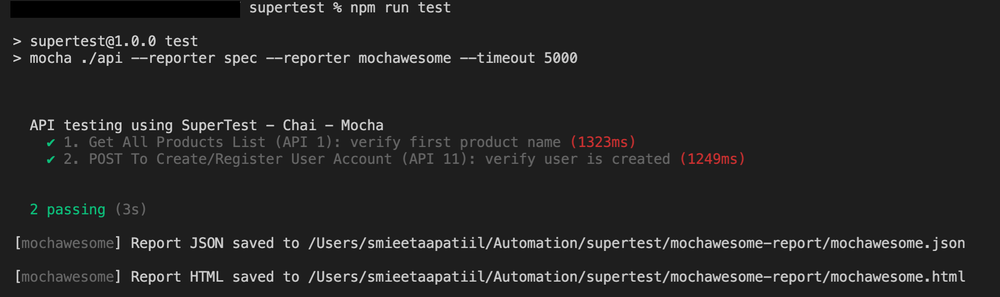

# API Testing using SuperTest, Chai and Mocha

## API Automation test assignment
1. API 1: Get All Products List: https://automationexercise.com/api/productsList
        1. Use above endpoint to GET a JSON response and assert that 200 OK is received
        2. Assert that 1st node in products JSON array returns “blue top”

2. API 11: POST To Create/Register User Account: https://automationexercise.com/api/createAccount
        1. Use above endpoint to trigger a POST method
        2. assert the http response code is 200 
        3. assert that “responseCode” in the response body is 201 
        4. assert that “message” in the response body is “User created!”

## Directory Structure:

/supertest  
&nbsp;&nbsp;&nbsp;&nbsp; /api-tests: the API test file  
&nbsp;&nbsp;&nbsp;&nbsp; /configs: environment configuration parameters likes URL  
&nbsp;&nbsp;&nbsp;&nbsp; /sample-exec-result: sample result screenshot  
&nbsp;&nbsp;&nbsp;&nbsp; /test-data: api test data    
&nbsp;&nbsp;&nbsp;&nbsp; /package.json: dependencies  

## Getting Started:

You need to have the following installed in your machine:

1. Install node and npm - https://nodejs.org/en/download/
2. verify the installation using below command:   
&nbsp;&nbsp; `node -v`  
&nbsp;&nbsp; `npm -v`
3. install supertest:  
&nbsp;&nbsp; `npm install supertest --sasave-dev` 
4. `mocha` framework is used for writing tests and `chai` for assertions, following command should help to install the required npm packages:  
&nbsp;&nbsp; `npm i -D -g supertest mocha chai mochawesome`
5. to run the test, run the command: `npm run test`
6. to generate the mochawesome report, run the command:   
&nbsp;&nbsp; `npm run test-report`   
&nbsp;&nbsp; You can view the report in `mochawesome.html` file in the `mochawesome-report` folder.

